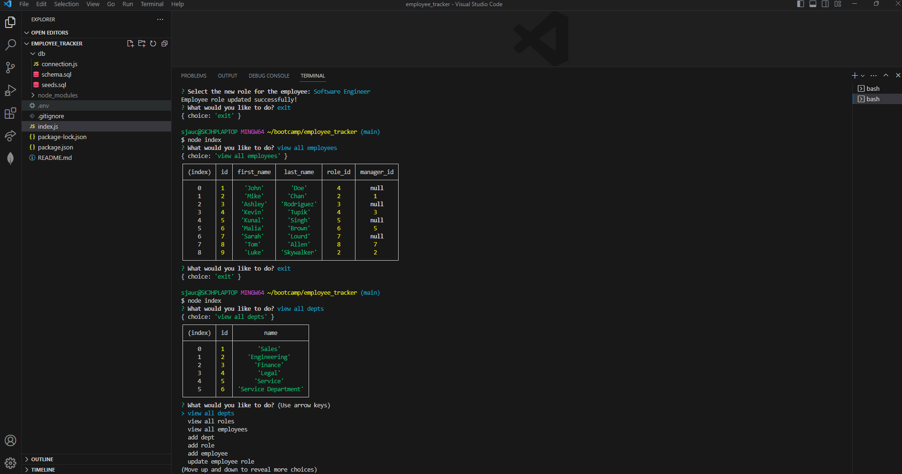

# Employee Tracker

## Description

A **Content Management System (CMS)** that will allow business owners to view departments, roles, and employees.  Business owners can also manage each by adding departments and roles.  There is also a function to update employees to include title, salary, department and supervisor.  This can all be done from the command line.

## Usage

Business owners will simply invoke the application by using "node index".  The user will then navigate the options by using the up and down arrows.

## Contributors

Stephanie Jauch and Meg Meyers.  Referenced Module 12, 02-Challenge and 28-Stu_Mini-Project.

##  GitHub Repo

https://github.com/SKJauch/employee_tracker

##  Video 
https://drive.google.com/file/d/1-QsddhBj2oRBB9zhV3G2ss-mpV5oVqx9/view

## Screenshot

[]